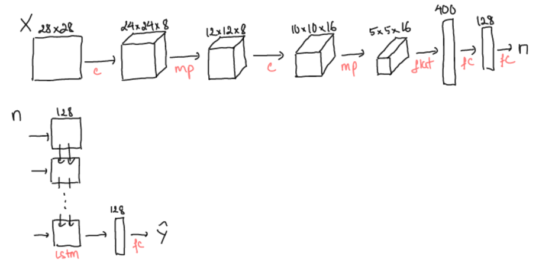
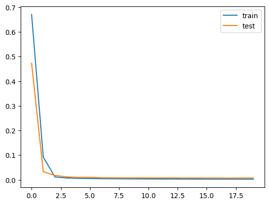

# Predicting Sums from a Sequence of Handwritten Digits

## Description
This project aims to predict the sum of a sequence of handwritten digits. The objective is to input a sequence of digit images, process them using a deep learning model, and output the predicted sum of the digits in the sequence. The model leverages convolutional neural networks (CNN) to recognize the individual digits and a Long Short-Term Memory (LSTM) network to process the sequence and predict the sum.

### Input:
- **Sequence of Handwritten Digits**: A series of images representing handwritten digits.
- **Sequence Length**: An integer specifying the number of digits in the input sequence.

### Output:
- **Predicted Sum**: An integer representing the predicted sum of the sequence of digits.

## Approach

### CNN + LSTM Architecture
The core architecture for this project involves combining a Convolutional Neural Network (CNN) and a Long Short-Term Memory (LSTM) model. This hybrid architecture is designed to first recognize each handwritten digit and then process the sequence of digits to predict their sum.

- **CNN (Convolutional Neural Network)**: The CNN is trained on the MNIST dataset to recognize individual digits in the input images. It extracts features from each digit image and converts them into a numerical representation that can be processed by the LSTM.
- **LSTM (Long Short-Term Memory)**: The LSTM network is used to handle the sequence of digits, capturing the temporal dependencies between the digits in the sequence. The output of the LSTM is a predicted sum of the digits.

By combining CNN for digit recognition with LSTM for sequence processing, this model is able to effectively predict the sum of a sequence of handwritten digits.

**Model Architecture Overview**:
- **CNN Backbone**: Responsible for recognizing each digit in the sequence.
- **LSTM Head**: Processes the sequence of recognized digits and predicts their sum.

  

**Training**: 
- The model was trained on a custom dataset processed from the MNIST dataset, where each sequence consists of randomly selected digits and their corresponding sum as the label.

**Result**: 
- The trained model achieved a **Mean Absolute Error (MAE) of 0.83828**, indicating the average error in predicting the sum of the digit sequences.

  

  

